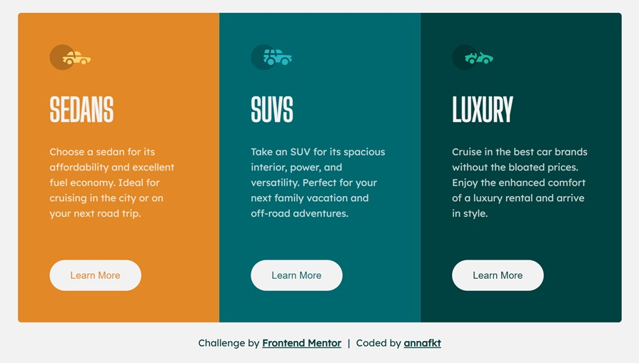

# Frontend Mentor - 3-column preview card component solution

This is my solution to the [3-column preview card component challenge on Frontend Mentor](https://www.frontendmentor.io/challenges/3column-preview-card-component-pH92eAR2-).

## The challenge

Users should be able to:

- View the optimal layout depending on their device's screen size
- See hover states for interactive elements

## Screenshot

<table>
  <tr>
    <td></td>
    <td rowspan="2"></td>
  </tr>
  <tr>
    <td></td>
  </tr>
</table>

## Built with

- Semantic HTML5 markup
- CSS Grid
- Mobile-first workflow

## Author

- CodePen - [annafkt](https://codepen.io/annafkt)
