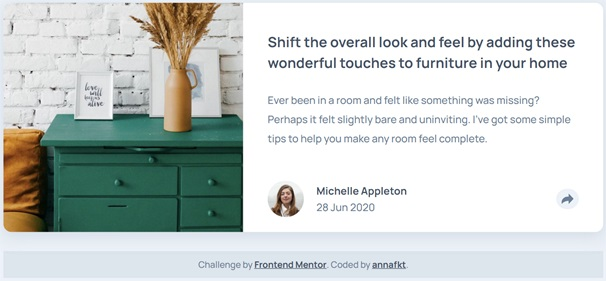
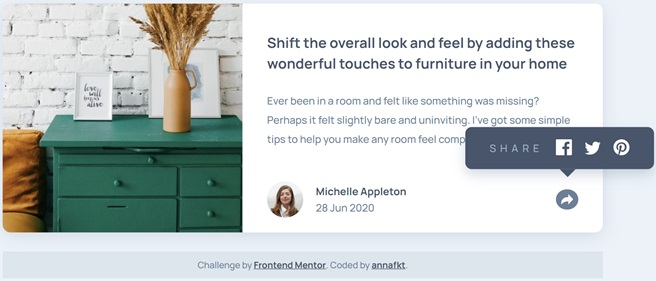
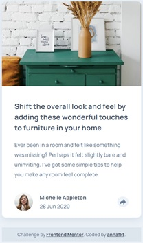
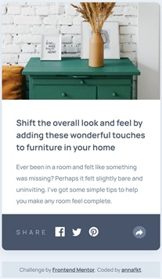

# Frontend Mentor - Article preview component solution

This is my solution to the [Article preview component challenge on Frontend Mentor](https://www.frontendmentor.io/challenges/article-preview-component-dYBN_pYFT).

## The challenge

Users should be able to:

- View the optimal layout for the component depending on their device's screen size
- See the social media share links when they click the share icon

## Screenshots

<table>
  <tr>
    <td>
    </td>
    <td>
    </td>
  </tr>
</table>

## Built with

- Semantic HTML5 markup
- CSS Grid
- Sass
- JavaScript
- Mobile-first workflow

## Useful resources

- Some thoughts about which is better: to put the header inside an anchor tag or the anchor tag inside the header. 
[Link in header? Or header in link?](https://css-tricks.com/link-header-header-link/) - *CSS Tricks*

- Access CSS property values with JavaScript 
[window.getComputedStyle()](https://developer.mozilla.org/en-US/docs/Web/API/Window/getComputedStyle) - *MDN Web Docs* 
[getPropertyValue()](https://developer.mozilla.org/en-US/docs/Web/API/CSSStyleDeclaration/getPropertyValue) - *MDN Web Docs*

- A really good summary of the variable keywords in JavaScript 
[Var, let and const](https://www.freecodecamp.org/news/differences-between-var-let-const-javascript/) - *freeCodeCamp* 
And this is an interesting argument about the subject: 
[Let or const?](https://stackoverflow.com/questions/41086633/in-javascript-why-should-i-usually-prefer-const-to-let) - *Stackoverflow*

## Author

- CodePen - [@annafkt](https://codepen.io/annafkt)