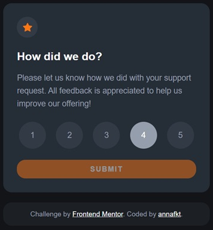
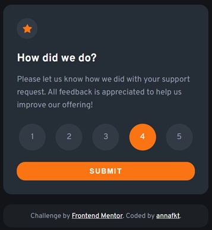
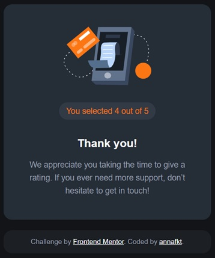

# Frontend Mentor - Interactive rating component solution

This is a solution to the [Interactive rating component challenge on Frontend Mentor](https://www.frontendmentor.io/challenges/interactive-rating-component-koxpeBUmI).

## The challenge

Users should be able to:

- View the optimal layout for the app depending on their device's screen size
- See hover states for all interactive elements on the page
- Select and submit a number rating
- See the "Thank you" card state after submitting a rating

## Screenshots

<table>
  <tr>
    <td></td>
    <td></td>
    <td></td>
  </tr>
</table>

## Built with

- Semantic HTML5 markup
- CSS Grid
- Sass
- JavaScript

## Useful resources

- [Input element with type submit](https://developer.mozilla.org/en-US/docs/Web/HTML/Element/input/submit) - *MDN Web Docs*

- [JS submit event](https://developer.mozilla.org/en-US/docs/Web/API/HTMLFormElement/submit_event) - *MDN Web Docs*

- [Event objects](https://developer.mozilla.org/en-US/docs/Learn/JavaScript/Building_blocks/Events#event_objects) - *MDN Web Docs*

- [JS template literals](https://developer.mozilla.org/en-US/docs/Web/JavaScript/Reference/Template_literals) - *MDN Web Docs*

## Author

- CodePen - [@annafkt](https://codepen.io/annafkt)