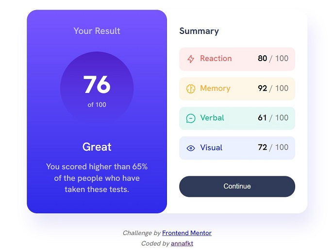
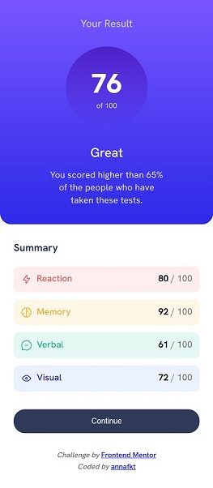

# Frontend Mentor - Results summary component solution

This is my solution to the [Results summary component challenge on Frontend Mentor](https://www.frontendmentor.io/challenges/results-summary-component-CE_K6s0maV).
 Frontend Mentor challenges help you improve your coding skills by building realistic projects.

## The challenge

Users should be able to:

- View the optimal layout for the interface depending on their device's screen size
- See hover and focus states for all interactive elements on the page

## Screenshots

<table>
  <tr>
    <td></td>
    <td></td>
  </tr>
</table>

## Built with

- Semantic HTML5 markup
- Flexbox
- Mobile-first workflow

## Resources I used

- I ran into a problem similar to this when I was trying to center the container: 
[Flex item overflows at the top](https://stackoverflow.com/questions/33454533/cant-scroll-to-top-of-flex-item-that-is-overflowing-container) - *Stackoverflow* 
The solution was to use auto margins on the flex item instead of `justify-content` and `align-items` on the flex box. 
See also: 
[Flexbox and auto margins](https://css-tricks.com/the-peculiar-magic-of-flexbox-and-auto-margins/) - *CSS Tricks* 
[Box Alignment - Alignment and auto margins](https://developer.mozilla.org/en-US/docs/Web/CSS/CSS_Box_Alignment/Box_Alignment_in_Flexbox#alignment_and_auto_margins) - *MDN Web Docs*

- To vertically center the text ***"76 of 100"*** I set the `line-height` of the paragraph to be equal to its height. 
But since it's a two-line text I needed some additional tricks, too: 
[Vertically center a text](https://stackoverflow.com/questions/8865458/how-do-i-vertically-center-text-with-css) - *Stackoverflow*

- I added a white border to the focused button for accessibility reasons. 
Then I had to realize that `box-sizing: border-box` doesn't work without a specified height. 
Every time I clicked the button, its size got bigger and pushed the whole layout away. 
The idea to use a transparent border around it when it is not in the focused state came from here: 
[Border-box without setting the height](https://stackoverflow.com/questions/52242410/box-sizing-border-box-with-no-declared-height-width) - *Stackoverflow*

- [How to use SVG in HTML and CSS](https://www.freecodecamp.org/news/use-svg-images-in-css-html/) - *freeCodeCamp*
- [Set an img as decorative (rather than meaningful) with an empty alt attribute](https://www.w3schools.com/accessibility/accessibility_meaningful_images.php) - *W3School*
- [Style a button only for keyboard navigation](https://css-tricks.com/keyboard-only-focus-styles/) - *CSS Tricks*

## Author

- CodePen - [@annafkt](https://codepen.io/annafkt)
