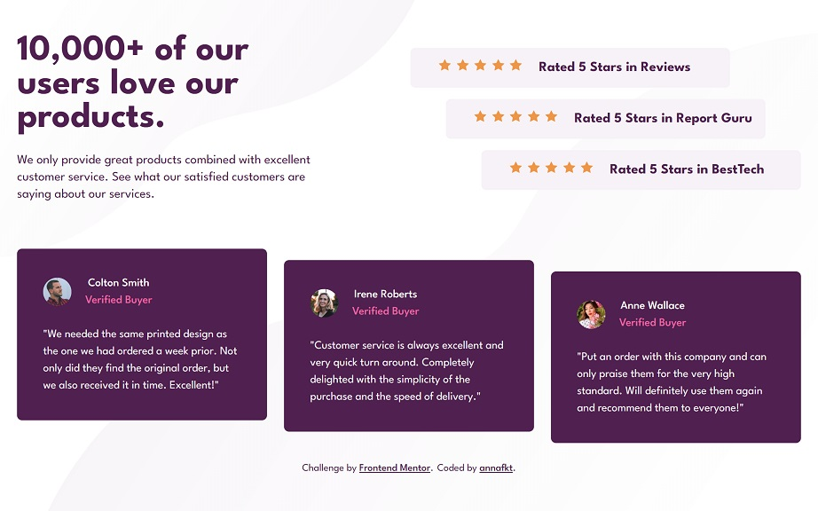

# Frontend Mentor - Social proof section solution

This is my solution to the [Social proof section challenge on Frontend Mentor](https://www.frontendmentor.io/challenges/social-proof-section-6e0qTv_bA).

## The challenge

Users should be able to:

- View the optimal layout for the section depending on their device's screen size

## Screenshot

<table>
  <tr>
    <td></td>
    <td></td>
  </tr>
</table>

## Built with

- Semantic HTML5 markup
- Grid
- Mobile-first workflow
- Sass

## Useful resources

- Shrinking parent with floated children: [Link1](https://stackoverflow.com/questions/11498946/div-shrinks-when-float-is-applied-to-its-sub-elements), [Link2](https://stackoverflow.com/questions/16041229/css-overflowhidden-with-floats) *(Stackoverflow)*

- [Quotations in HTML](https://css-tricks.com/quoting-in-html-quotations-citations-and-blockquotes/) *(CSS Tricks)* 
[Figure element](https://developer.mozilla.org/en-US/docs/Web/HTML/Element/figure) *(MDN Web Docs)*

- [Best practises for nesting in Sass](https://stackoverflow.com/questions/13805324/how-bad-is-it-in-practice-to-over-nest-selectors-in-sass-scss) *(Stackoverflow)*

- [Sass style guide](https://css-tricks.com/sass-style-guide/) *(CSS Tricks)*

## Author

- CodePen - [@annafkt](https://codepen.io/annafkt)