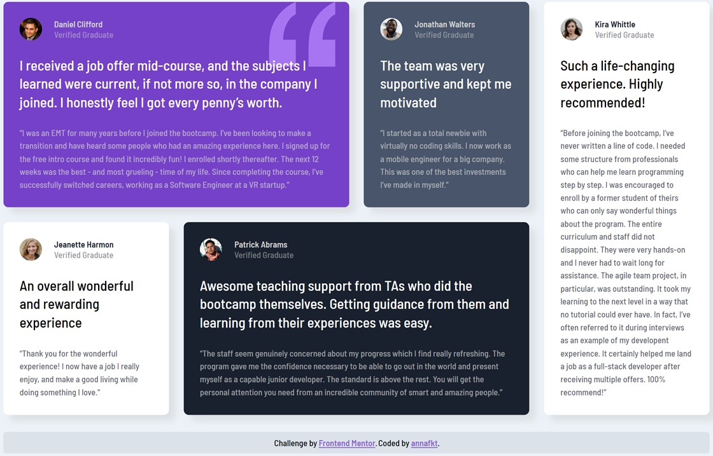
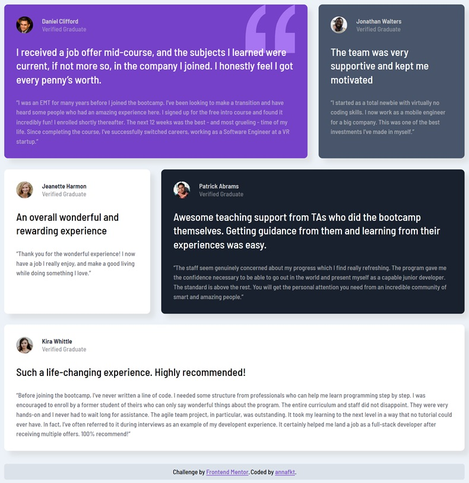

# Frontend Mentor - Testimonials grid section solution

This is my solution to the [Testimonials grid section challenge on Frontend Mentor](https://www.frontendmentor.io/challenges/testimonials-grid-section-Nnw6J7Un7). 
Frontend Mentor challenges help you improve your coding skills by building realistic projects.

## The challenge

Users should be able to:

- View the optimal layout for the site depending on their device's screen size

## Screenshots

<table>
  <tr>
    <td></td>
    <td></td>
  </tr>
</table>

## Live

You can see the live demo here:
[Testimonials grid section](https://annafkt.github.io/frontend-mentor-challenges/challenges/testimonials-grid-section/index.html)

## Built with

- Semantic HTML5 markup
- CSS Grid
- Sass

## Resources I used

- [A complete guide to CSS Grid](https://css-tricks.com/snippets/css/complete-guide-grid/) - *CSS Tricks*

- [Understanding grid template areas](https://www.smashingmagazine.com/understanding-css-grid-template-areas) - *Smashing Magazine*

## Author

- CodePen - [annafkt](https://codepen.io/annafkt)