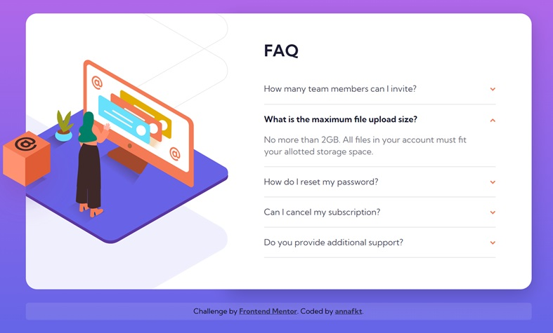

# Frontend Mentor - FAQ accordion card solution

This is a solution to the [FAQ accordion card challenge on Frontend Mentor](https://www.frontendmentor.io/challenges/faq-accordion-card-XlyjD0Oam).

## The challenge

Users should be able to:

- View the optimal layout for the component depending on their device's screen size
- See hover states for all interactive elements on the page
- Hide/Show the answer to a question when the question is clicked

## Screenshots

<table>
  <tr>
    <td></td>
    <td></td>
  </tr>
</table>

## Built with

- Semantic HTML5 markup
- CSS Grid
- Sass
- JavaScript

## Resources I used

- [Event currentTarget property](https://developer.mozilla.org/en-US/docs/Web/API/Event/currentTarget) - *MDN Web Docs*

- [HTML hidden attribute](https://developer.mozilla.org/en-US/docs/Web/HTML/Global_attributes/hidden) - *MDN Web Docs*

- [How to make non-interactive elements navigable by keyboard via JavaScript](https://developer.mozilla.org/en-US/docs/Web/Accessibility/Keyboard-navigable_JavaScript_widgets) - *MDN Web Docs*

- In [this video](https://www.youtube.com/watch?v=rIO5326FgPE) (by *Web Dev Simplified*) about CSS box model I found an important detail which was completely new to me: [margins can collapse vertically](https://developer.mozilla.org/en-US/docs/Web/CSS/CSS_box_model/Mastering_margin_collapsing) - *MDN Web Docs*

## Author

- CodePen - [@annafkt](https://codepen.io/annafkt)